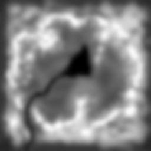
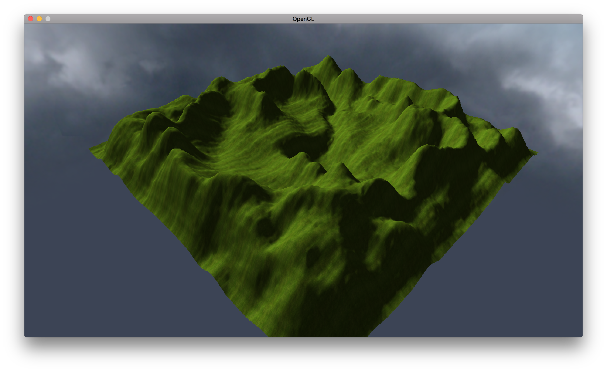
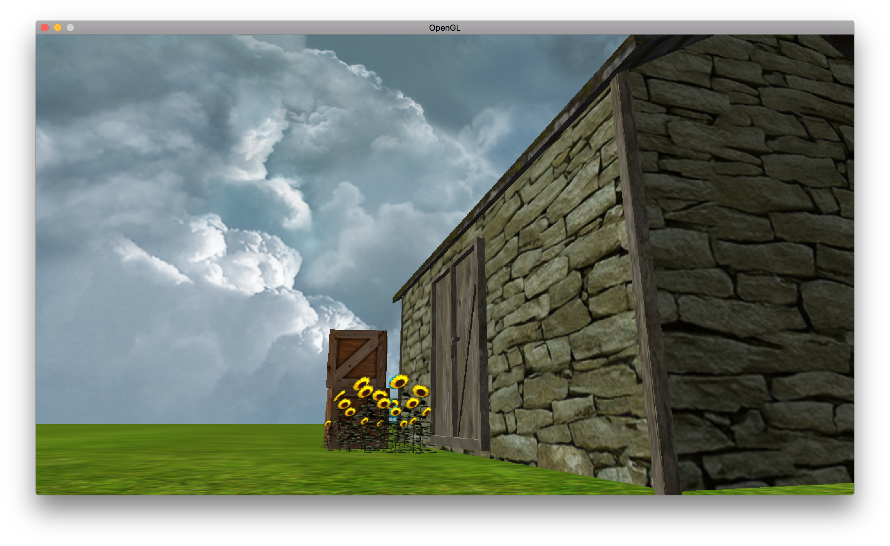
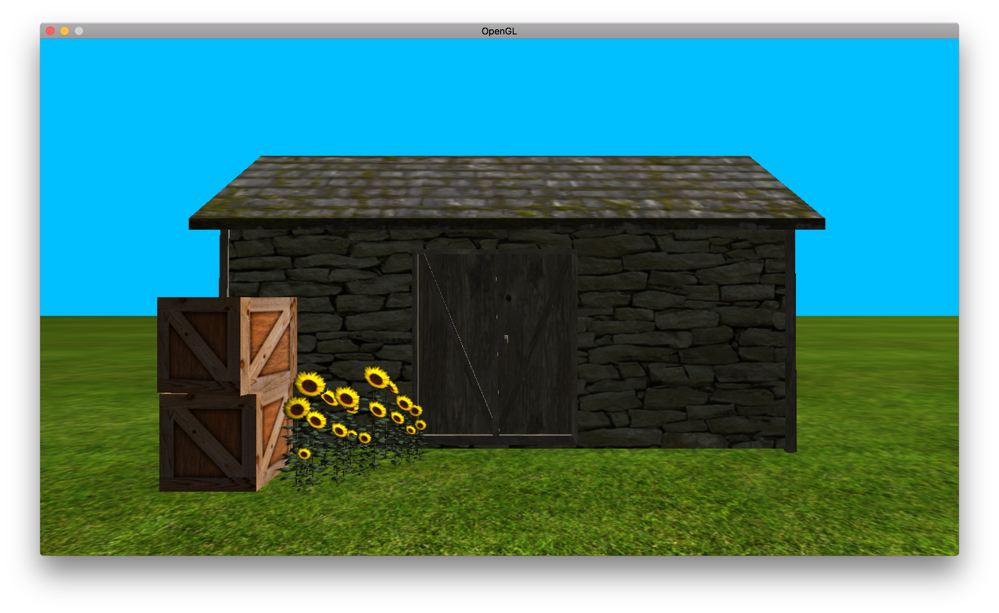
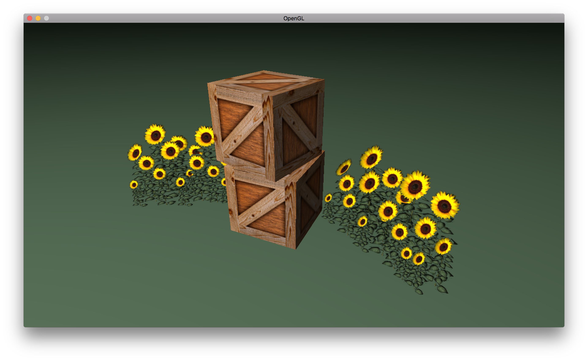
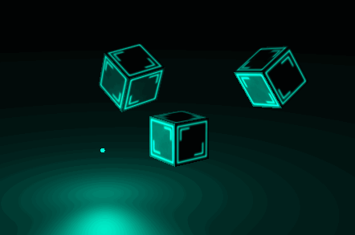
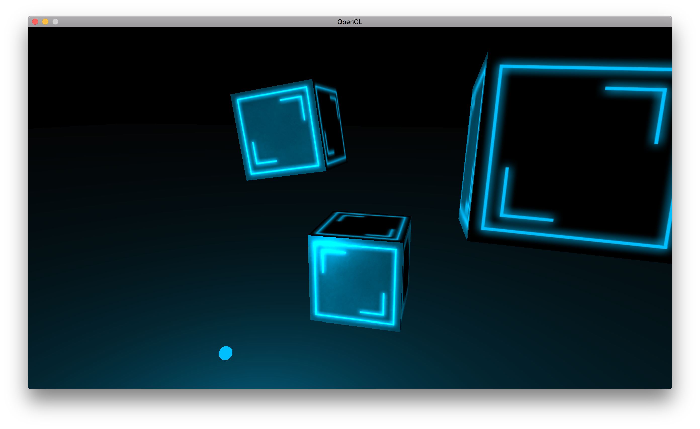
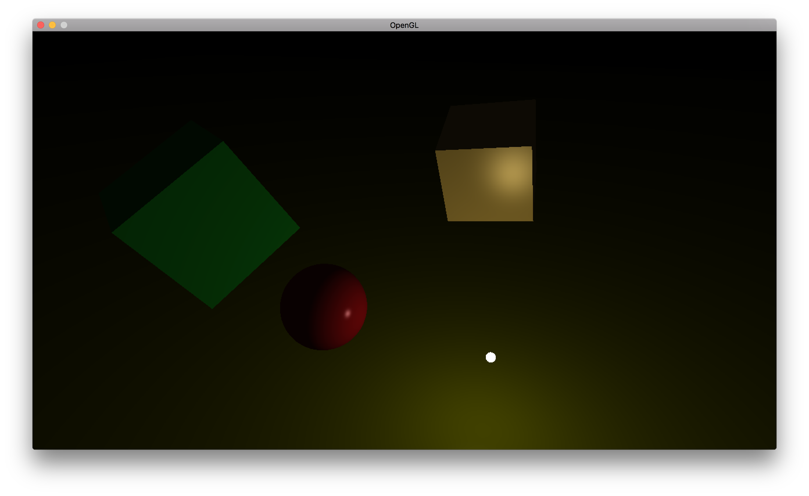

# OpenGL 3D Game Engine
A 3D game engine created with OpenGL and regularly updated.

## Dependencies
SDL2

SDL2_Image

GLM

GLEW

## Update 6
### Generating Terrain from a Heightmap
Before, the only terrain option was a tiled plane, but now you can have terrain with different heights. The idea is to import a picture, and have the intensity of each pixel of the texture be the height of the vertex. There were a couple of challenges to overcome with generating this terrain, especially with calculating the normals, but I found a suitable algorithm for doing this. I have also introduced element buffers with this terrain. With the large number of vetices in the terrain, it became far more efficient to define each face, instead of re-adding the same vertex eight times over and then drawing it.

Loading in terrain into the game engine is easy, just specify a heightmap and the texture you want to use on the terrain.
```cpp
terrain = new Terrain((GLchar*) "heightmap.jpg", (GLchar*)"grass_diffuse.jpg");
```
And since the terrain in a sub class of primitive, to draw the terrain just use the `render()` method. For this terrain I used this heightmap:



With this result,




## Update 5
### Skyboxes and Cubemaps
Skyboxes have been implemented and are simply a textured cube that surrounds the player. Depth testing for the skybox is disabled, so objects are always rendered in front of the skybox, as the skybox is a 1x1 cube that is not affected by the translation of the camera, giving the impression of sky in the distance. I have also added a new texture class called CubeMap, which allows you to load 6 different images corresponding to the 6 faces of the cube. A CubeMap is constructed by taking a vector of six images,
```cpp
map = new CubeMap(vector<GLchar*>{
        (GLchar*)"miramar/miramar_ft.tga",
        (GLchar*)"miramar/miramar_bk.tga",
        (GLchar*)"miramar/miramar_up.tga",
        (GLchar*)"miramar/miramar_dn.tga",
        (GLchar*)"miramar/miramar_rt.tga",
        (GLchar*)"miramar/miramar_lf.tga"
});
```
And the sky box class is constructed by taking in a CubeMap as an argument,
```cpp
env = new SkyBox(map);
```
[A link to some high quality sky box textures can be found here.](http://www.custommapmakers.org/skyboxes.php)
And here are the results,


## Update 4
### Tiling the Plane
A new plane primitive has been introduced called a tile. A tile gives the ability to have a sprawling, repeating-texture, plane. I do this by adding more verticies to the vertex array, to define where the texture should repeat. The constructor for a tile is as such, taking in a vector of textures and a radius, defining how many times the texture should repeat,

```cpp
grassField = new Tile(
    vector<Texture*> {
        new Texture("grass_diffuse.jpg", MAP::DIFFUSE)
    }, 5);
```
I've also added some new models. Here are the results so far,

The super class for the tile is the primitive class, so all the scale, rotate, and translation methods will work and the tile uses the same shader.

## Update 3
### Model Loading
Model loading is now a feature. I am using th Assimp library so that models of different types can be loaded, including .3ds, .obj, and .max. This converts the model to an intermediate XML like format, which is then parsed by my own code so that it can work in my game engine. The main benefit to using Assimp is to support a large range of different object files. The constructor for the model class takes in a 3d model file and a vector of different texture types. Right now the model loading can onlytake in models composed of one mesh, and that contain one of each type of texture. It works in the same way that the cube class below works, so for instance if I wanted to load in the sunflower object file I would use the constructor as such,

```cpp
sunflower = new Model(
    (GLchar*)"sunflower/sunflower.obj", 
    vector<Texture*> {
        new Texture("sunflower/sunflower_diffuse.png", MAP::DIFFUSE)
    }
);
```
With the results below,

The next improvements I will make with this is instancing, such that I can display multiple copies of the same object more efficiently.

## Update 2
### Diffuse, Specular, and Emission Lighting Maps
The game engine now has the ability to have different lighting maps including diffuse, specular, and emission maps. The cube primitive now has a constructor to take in a vector of Textures of different types and I have added a new fragment shader to handle the lighting maps. The images attached below demonstrate the new lighting maps in all their glory. The cubes have a shininess from the the specular map and a beautiful glow from the emssion map.




## Update 1

I am documententing my progress to create a modern OpenGL game engine. Before deciding to post my results on GitHub, I had created a simple Phong shader for the lighting model, and the ability to apply different shaders to different objects. I have three primitives in the primitive class: cube, sphere, and plane. I will attach a screen shot of my progress with each merge to the master branch.


